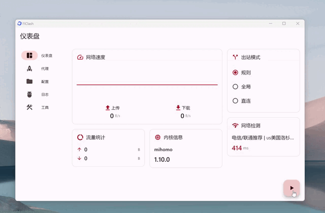

<div>

[**简体中文**](README_zh_CN.md)

</div>

> BfClash is based on the GPL-3.0 FlClash project and keeps its complete multi-platform proxy feature set while providing independent branding and releases.

## BfClash

[](https://github.com/bft2249228496/clash-self/releases/)[](https://github.com/bft2249228496/clash-self/releases/)[](LICENSE)

[](https://github.com/bft2249228496/clash-self)

A multi-platform proxy client based on ClashMeta, simple and easy to use, open-source and ad-free.

on Desktop:
<p style="text-align: center;">
    
</p>

on Mobile:
<p style="text-align: center;">
    
</p>

## Features

✈️ Multi-platform: Android, Windows, macOS and Linux

💻 Adaptive multiple screen sizes, Multiple color themes available

💡 Based on Material You Design, [Surfboard](https://github.com/getsurfboard/surfboard)-like UI

☁️ Supports data sync via WebDAV

✨ Support subscription link, Dark mode

## Use

### Linux

⚠️ Make sure to install the following dependencies before using them

   ```bash
    sudo apt-get install libayatana-appindicator3-dev
   ```

### Android

Support the following actions

   ```bash
    com.lansway.client.action.START
    
    com.lansway.client.action.STOP
    
    com.lansway.client.action.TOGGLE
   ```

## Download

<a href="https://chen08209.github.io/FlClash-fdroid-repo/repo?fingerprint=789D6D32668712EF7672F9E58DEEB15FBD6DCEEC5AE7A4371EA72F2AAE8A12FD"></a> <a href="https://github.com/bft2249228496/clash-self/releases"></a>

### Homebrew

```bash
brew tap chen08209/tap
brew install --cask flclash
```

## Build

1. Update submodules
   ```bash
   git submodule update --init --recursive
   ```

2. Install `Flutter` and `Golang` environment

3. Build Application

    - android

        1. Install `Android SDK`, `Android NDK`

        2. Set `ANDROID_NDK` environment variable

        3. Run build script

           ```bash
           dart setup.dart android
           ```

    - windows

        1. Requires a Windows client

        2. Install `GCC`, `Inno Setup`

        3. Run build script

           ```bash
           dart setup.dart windows
           ```

    - linux

        1. Requires a Linux client

        2. Dependencies are auto-installed by setup script, or manually:
           ```bash
           sudo apt-get install -y libayatana-appindicator3-dev
           ```

        3. Run build script

           ```bash
           dart setup.dart linux
           ```

    - macOS

        1. Requires a macOS client

        2. Run build script

           ```bash
           dart setup.dart macos
           ```

## Star

The easiest way to support developers is to click on the star (⭐) at the top of the page.

<p style="text-align: center;">
    <a href="https://api.star-history.com/svg?repos=bft2249228496/clash-self&Date">
        
    </a>
</p>
